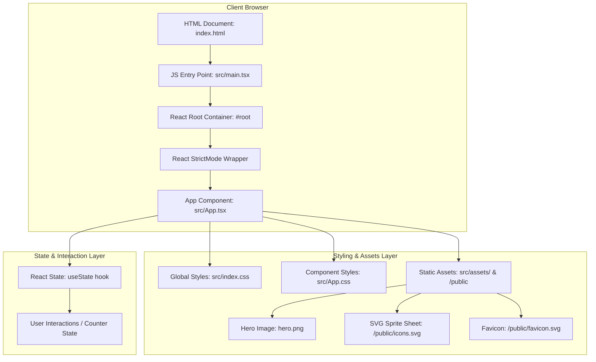

# 📈 InvestraX — Next-Gen Trading & Investment Web Application

[](https://react.dev/)
[](https://www.typescriptlang.org/)
[](https://vite.dev/)
[](https://eslint.org/)
[](LICENSE)

---

## 📌 Executive Summary

**InvestraX** is a modern, high-performance, single-page web application inspired by **Zerodha** (India's leading discount stock brokerage platform, Kite). The project leverages state-of-the-art frontend web technologies — **React 19**, **TypeScript**, and **Vite** — to provide a lightning-fast, accessible, and responsive user experience for stock trading, portfolio tracking, market analysis, and financial asset management.

Designed with modularity and developer experience in mind, this project serves as a robust foundational template and trading frontend architecture ready to connect with real-time WebSockets, stock ticker APIs, order execution engines, and financial analytics backends.

---

## 🛠️ Technology Stack & Specifications

### Core Frameworks & Libraries

| Category | Technology | Version | Description / Role |
| :--- | :--- | :--- | :--- |
| **UI Library** | [React](https://react.dev/) | `^19.2.6` | Declarative UI components, stateful hooks, DOM reconciliation |
| **DOM Renderer** | [React DOM](https://react.dev/) | `^19.2.6` | Rendering React components into client browser DOM |
| **Language** | [TypeScript](https://www.typescriptlang.org/) | `~6.0.2` | Static type safety, interface definitions, compiler strictness |
| **Build Tool & Server** | [Vite](https://vite.dev/) | `^8.0.12` | Next-gen frontend tooling, instant HMR, Rollup bundling |
| **React Vite Plugin** | `@vitejs/plugin-react` | `^6.0.1` | Fast Refresh, JSX/TSX transformation via Oxc compiler |
| **Linter & Code Quality** | [ESLint](https://eslint.org/) | `^10.3.0` | Code formatting rules, React Hooks & Refresh linting plugins |

### Tooling & Runtime Specs
- **Module System**: ES Modules (`"type": "module"`)
- **Type Definitions**: `@types/react`, `@types/react-dom`, `@types/node`
- **Linting Rules**: `eslint-plugin-react-hooks`, `eslint-plugin-react-refresh`, `typescript-eslint`

---

## 🏗️ System Architecture & Data Flow

### 1. High-Level Architecture Diagram



### 2. Execution & Bootstrapping Sequence

```
[Browser Request]
       │
       ▼
[index.html]  ──────► Loads <script type="module" src="/src/main.tsx">
       │
       ▼
[src/main.tsx] ─────► Imports React, ReactDOM, index.css, and App.tsx
       │              Mounts <StrictMode><App /></StrictMode> into #root
       ▼
[src/App.tsx] ──────► Renders Hero Section, State Controls, SVG Icons, 
       │              External Documentation Links & Community Resources
       ▼
[Client DOM Rendered] ◄── Responds to user actions (clicks, counter increments, link navigation)
```

---

## 📁 Directory & File Structure

```
zerodha-clone/
├── public/                     # Static public assets served at root
│   ├── favicon.svg             # Website tab icon
│   └── icons.svg               # SVG icon sprite sheet (Docs, Social, GitHub, etc.)
├── src/                        # Source code directory
│   ├── assets/                 # Component-bound static assets
│   │   ├── hero.png            # Hero visual graphic asset
│   │   ├── react.svg           # React logo vector graphic
│   │   └── vite.svg            # Vite logo vector graphic
│   ├── App.css                 # Component-specific styles and CSS layouts
│   ├── App.tsx                 # Core Application root component
│   ├── index.css               # Global baseline typography, reset, & theme styles
│   ├── main.tsx                # Client application bootstrapping entrypoint
│   └── vite-env.d.ts           # TypeScript environment reference types
├── .gitignore                  # Git repository exclusion definitions
├── eslint.config.js            # Flat ESLint configuration rules & plugins setup
├── index.html                  # Single-page HTML host shell
├── package.json                # Project dependencies, scripts, and package metadata
├── tsconfig.app.json           # Application TypeScript configuration (Browser scope)
├── tsconfig.json               # Root solution TypeScript configuration wrapper
├── tsconfig.node.json          # Node/Vite build tooling TypeScript configuration
├── vite.config.ts              # Vite server & bundler configuration setup
└── README.md                   # Project documentation (this file)
```

---

## 📄 Key File Responsibilities

| File | Purpose & Responsibilities |
| :--- | :--- |
| [`src/App.tsx`](file:///c:/Users/singh/.gemini/antigravity/scratch/zerodha-clone/src/App.tsx) | Core layout component containing hero branding, interactive state counter, icon sprite usages, and navigation links. |
| [`src/main.tsx`](file:///c:/Users/singh/.gemini/antigravity/scratch/zerodha-clone/src/main.tsx) | Mounts the React application tree into the HTML `#root` node inside `StrictMode`. |
| [`src/App.css`](file:///c:/Users/singh/.gemini/antigravity/scratch/zerodha-clone/App.css) | Layout styles, flexbox grid alignments, hero image transitions, button styling. |
| [`src/index.css`](file:///c:/Users/singh/.gemini/antigravity/scratch/zerodha-clone/index.css) | Base typography reset, color scheme system (dark/light theme support), CSS variables. |
| [`vite.config.ts`](file:///c:/Users/singh/.gemini/antigravity/scratch/zerodha-clone/vite.config.ts) | Vite build tool settings equipped with `@vitejs/plugin-react`. |
| [`eslint.config.js`](file:///c:/Users/singh/.gemini/antigravity/scratch/zerodha-clone/eslint.config.js) | Configures JavaScript/TypeScript linting, React Hook checks, and React Refresh rules. |
| [`package.json`](file:///c:/Users/singh/.gemini/antigravity/scratch/zerodha-clone/package.json) | Defines scripts (`dev`, `build`, `lint`, `preview`), dependencies (`react`, `react-dom`), and dev toolchain. |

---

## ⚡ Getting Started & Quickstart Guide

### Prerequisites

Ensure your development environment meets the following specifications:
- **Node.js**: `v18.x` or `v20.x` or later
- **npm**: `v9.x` or later (or `yarn` / `pnpm` / `bun`)

### 1. Installation

Clone or locate the repository directory and install all node packages:

```bash
cd investrax
npm install
```

### 2. Development Server

Start the local Vite development server with Hot Module Replacement (HMR):

```bash
npm run dev
```
By default, the server will launch at: `http://localhost:5173/`

### 3. Production Build

Compile TypeScript and build optimized static assets for production deployment:

```bash
npm run build
```
Output files will be generated in the `dist/` directory.

### 4. Preview Build

Locally serve the compiled production build to verify bundle performance:

```bash
npm run preview
```

### 5. Code Quality & Linting

Run ESLint to check for syntax issues, unused variables, and React hook constraint violations:

```bash
npm run lint
```

---

## 📜 Available NPM Scripts

| Script Command | Command Executed | Description |
| :--- | :--- | :--- |
| `npm run dev` | `vite` | Starts Vite local development server with HMR |
| `npm run build` | `tsc -b && vite build` | Runs TypeScript type-checks and builds production bundle |
| `npm run lint` | `eslint .` | Runs ESLint across all `.ts` and `.tsx` source files |
| `npm run preview` | `vite preview` | Serves production `dist/` bundle locally for testing |

---

## 🚀 Future Feature & Architectural Roadmap

The following phases outline the planned expansion of InvestraX into a full-scale trading portal:

- **Phase 1: Trading Dashboard UI (Kite Interface)**
  - Sidebar Watchlist with live green/red percentage ticks.
  - Header Navigation: Dashboard, Orders, Holdings, Positions, Funds, Apps, User Profile.
- **Phase 2: Interactive Stock Charts & Visualizations**
  - Integration of [Lightweight Charts](https://github.com/tradingview/lightweight-charts) or Chart.js for Candlestick and Line charts.
  - Timeframe switches (1D, 5D, 1M, 1Y, ALL) and technical indicator overlays.
- **Phase 3: Order Execution Engine**
  - Order Placement Drawer (BUY / SELL toggle, Market / Limit / SL / SL-M order types).
  - Quantity input, price limit setter, trigger price configuration.
  - Interactive Order Book and Executed Trades log.
- **Phase 4: Real-time Data & WebSocket Stream**
  - WebSocket market data feed subscriber for real-time LTP (Last Traded Price) updates.
  - Simulated market engine for realistic stock price fluctuations.
- **Phase 5: User Authentication & Portfolio Management**
  - Secure login/signup authentication flow.
  - Portfolio P&L calculation, invested amount vs current value, and holdings distribution charts.

---

## 🤝 Contributing Guidelines

1. **Format Code**: Ensure clean code formatting following ESLint rules.
2. **Type Safety**: Maintain strict TypeScript typing without using explicit `any` types.
3. **Commit Messages**: Use clean conventional commit messages (`feat:`, `fix:`, `docs:`, `style:`, `refactor:`).

---

## 📄 License

This project is licensed under the **MIT License**. Feel free to customize and extend it for learning and development.
